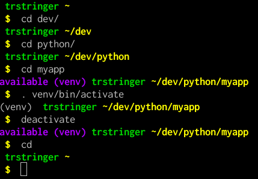

# Virtual Environment Detector (Bash)

This script is meant to be used for your bash prompt. It simply detects if the current directory likely includes a virtual environment that can be activated.

## Setup

1. `$ git clone https://github.com/tstringer/venvdetect.git`
1. Create a symlink from a path in `$PATH` to the python script
1. Change your `$PS1` env var in your `.bashrc` to include a call to the python script

A few things to note...

1. This script will use an *optional* env var `VENV_DIRS` for a comma-separated list of your common virtual environment directories. This will default to `venv` if unset
1. It won't show an "available" virtual environment if that virtual environment is already activated
